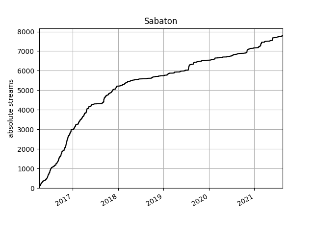
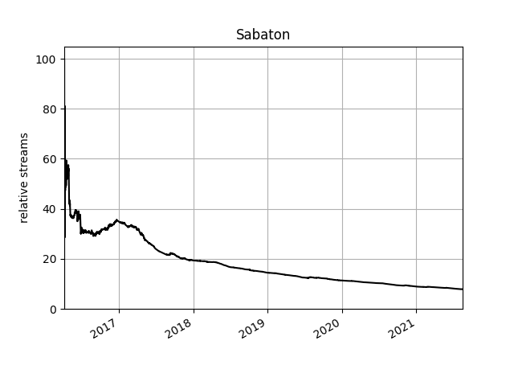

# Python Endsong Parser

Parser for Spotify `endsong.json` files made with Python

This project uses Black for [Python](https://github.com/psf/black), [Prettier](https://github.com/prettier/prettier) for Markdown formatting and [Markdownlint](https://github.com/markdownlint/markdownlint) for linting markdown. The disabled rules are specified in [.markdownlint.json](.markdownlint.json)

[](https://github.com/psf/black) [](https://github.com/prettier/prettier)

## Why

Lukas didn't want to use the [Spotistats app](https://spotistats.app/) to make the `endsong.json` files usable. So, in order extract the data and do something with it he wrote this script. At first it could only display the top artist/tracks, later you could search for specific tracks and now you can even view graphs showing the changes over time. I decided to modify this script to my own liking and here we are.

## Usage guide

1. Download the `endsong_parser.py` file
2. Open it in a text editor and at the end change the `path` array to match your paths
3. Open the script in an interactive python shell

   ```bash
   python3 -i endsong_parser.py
   ```

4. Wait for the script to parse the data
5. Use the many commands available! If you ever need help, use `help(d.<method>)` where `<method>` is the name of the method you need help with.

`aspect` can be either `"artist"`, `"album"` or `"title"`

`name` is the name of the artist, album or track

### Getting endsong.json

Follow the [Spotistats guide](https://support.spotistats.app/import/guide/) ([backup link](https://web.archive.org/web/20210824223644/https://support.spotistats.app/import/guide/)) to get the files.

### Graphs

There are two options for graphs: absolute and relative. The absolute graph is much faster and it visualizes the change to the total amount of listens of an aspect over time. The relative graph visualizes the change to the proportion of the aspect in regard to the total amount of listens at that point in time.

#### Absolute Graphs

```python
d.graph_abs(aspect, name)
```

<details>
<summary>Example</summary>

```python
d.graph_abs("artist", "Sabaton")
```



</details>

#### Relative Graphs

```python
d.graph_rel(aspect, name)
```

<details>
<summary>Example</summary>

```python
d.graph_rel("artist", "Sabaton")
```



</details>
