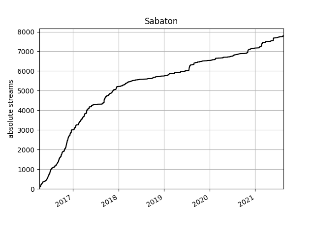
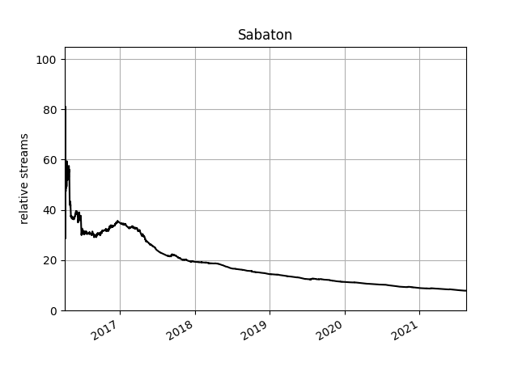

# Usage Guide

## Terminal data

### Changing dates

If you want to change the date range (default is beginning till end of Unix time), use:

```python
d.set_bounds(earliest_date, latest_date, tzoffset_to_utc=-1)
```

with `"YYYY.MM.DD-hh.mm.ss"` for date format. The offset to UTC is optional, but set to CET as default (difference UTC-your_timezone)

<details>
<summary>Example</summary>

```python
d.set_bounds("2020.01.03", "2021.05.08")
```

</details>

## Graphs

There are two options for graphs: absolute and relative. The absolute graph is much faster and it visualizes the change to the total amount of listens of an aspect over time. The relative graph visualizes the change to the proportion of the aspect in regard to the total amount of listens at that point in time.

### Absolute Graphs

```python
d.graph_abs(aspect, name)
```

<details>
<summary>Example</summary>

```python
d.graph_abs("artist", "Sabaton")
```



</details>

### Relative Graphs

```python
d.graph_rel(aspect, name)
```

<details>
<summary>Example</summary>

```python
d.graph_rel("artist", "Sabaton")
```



</details>
